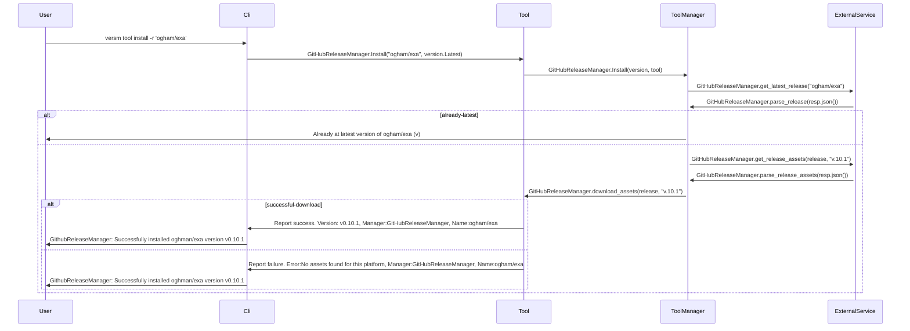
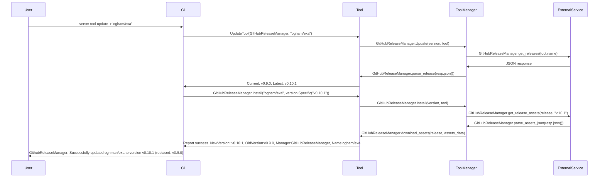

# Vers

Manage installs of dev tools, similar to ASDF except in Rust.

[](https://mermaid-js.github.io/mermaid-live-editor/edit##eyJjb2RlIjoiZ3JhcGggVERcbiAgICBBW0NocmlzdG1hc10gLS0-fEdldCBtb25leXwgQihHbyBzaG9wcGluZylcbiAgICBCIC0tPiBDe0xldCBtZSB0aGlua31cbiAgICBDIDwtLT58T25lfCBEW0xhcHRvcF1cbiAgICBDIC0tPnxUd298IEVbaVBob25lXVxuICAgIEMgLS0-fFRocmVlfCBGW2ZhOmZhLWNhciBDYXJdXG4gICIsIm1lcm1haWQiOiJ7XG4gIFwidGhlbWVcIjogXCJkZWZhdWx0XCJcbn0iLCJ1cGRhdGVFZGl0b3IiOmZhbHNlLCJhdXRvU3luYyI6dHJ1ZSwidXBkYXRlRGlhZ3JhbSI6ZmFsc2V9)

## Concepts

### Environment

An environment is a collection of [`Tools`](#tool) and [`Versions`](#version). Environments keep track of the tools and versions being managed for easy upgrades later using the `--update-all` command.

### ToolManager

Handles various functions required to install, delete or update a [`Tools`](#tool). 

### Tool

Installed by a tool manager in addition to the [`Version`](#version) 

### Version

A state of the tool version to install, typically `Latest` or `Specific`. Latest will keep the tool updated to the latest version available to the [`ToolManager`](#toolmanager)

## Tool Manager

A `ToolManager` trait

```rust
#[derive(Debug, Clone)]
#[async_trait]
pub trait ToolManager<T> 
  where T: Send + Sync + ToolManagerConfig
{
  fn async install_tool(&self, T) -> Result<ToolManagerError>;
  fn async update_tool(&self, T) -> Result<ToolManagerError>;
  fn async delete_tool(&self, T) -> Result<ToolManagerError>;
  fn async switch_tool_version(&self, T) -> Result<ToolManagerError>;
}
```

### Install New Tool Flow



### Update Tool Flow

